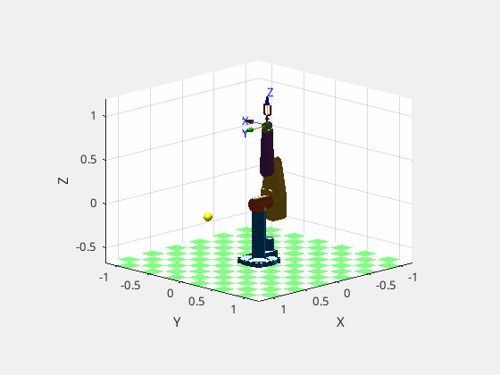
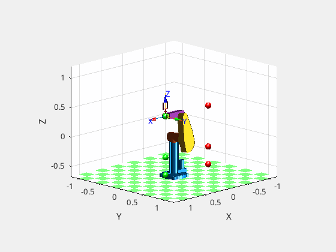

# Arm simulation

## Move to ball

## Pick and place

## Reference
* [Robotics Toolbox MATLAB - Peter Corke](https://github.com/petercorke/robotics-toolbox-matlab)
* [Go to goal](http://faculty.salina.k-state.edu/tim/robotics_sg/Algorithms/GoToGoal.html)
* [Puma simulator](https://cyberbotics.com/doc/guide/puma)